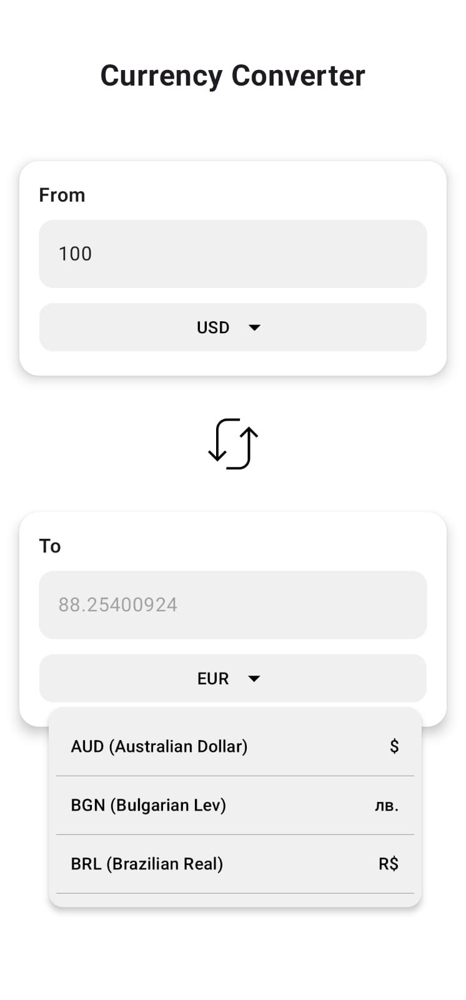
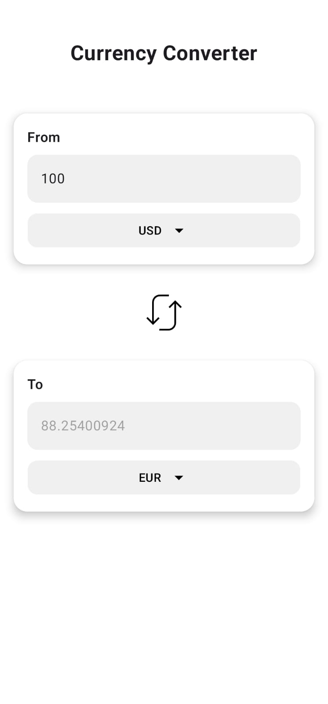

# Currency Converter App

This is a simple Android app to convert money between currencies.

## Features

- Convert currency amounts using live rates.
- Choose any currency from the list.
- Swap currencies with one tap.
- Shows errors if something goes wrong.

## How It Works

- Gets currency data from a free online API.
- Uses a secure API key stored safely.
- Updates conversion instantly when you change values.

## Screenshots
*Main screen of the app*

*Currency selection screen*

## Tech Used

- Kotlin + Jetpack Compose for UI.
- Retrofit and OkHttp for network calls.
- Dagger Hilt for dependency injection.
- Google Secret Manager for API key.

## How to Use

1. Clone this repo.
2. Add your API key using Google Secret Manager.
3. Run the app on your device or emulator.

## Requirements

- Android 8.0 (API 26) or higher.
- Internet connection.
